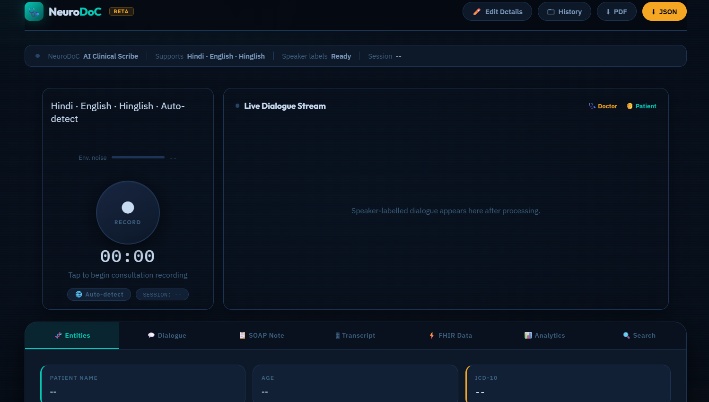
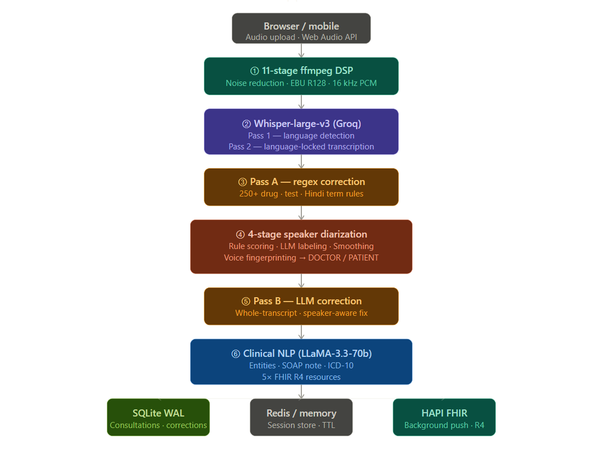

# 🩺 NeuroDoC
> *"The best clinical note is the one that writes itself."*

NeuroDoC is an ambient AI clinical scribe built for Indian hospitals. It listens to a doctor–patient conversation in **Hindi, English, or Hinglish**, figures out who said what, fixes every drug name and diagnosis, and hands back a complete clinical record — SOAP note, ICD-10 code, and HL7 FHIR R4 resources — in seconds. Zero typing.

🌐 **Live Demo** → [web-production-5bd46.up.railway.app](https://web-production-5bd46.up.railway.app/)



---

## 🚀 Features

- 🎙️ **Hospital-Grade Noise Reduction**  
  11-stage ffmpeg pipeline strips India 50 Hz hum, HVAC, monitor beeps, crowd noise, and mic handling — before audio ever reaches Whisper.

- 🗣️ **Two-Pass Whisper Transcription**  
  Pass 1 auto-detects language. Pass 2 re-transcribes with a language lock and a custom 224-token Indian medical vocabulary prompt for maximum accuracy.

- 👥 **4-Stage Speaker Diarization**  
  Labels every segment DOCTOR or PATIENT — no voice enrollment needed. Rule scoring → LLM labeling → smoothing → voice fingerprinting.

- ✍️ **2-Pass Medical Correction**  
  250+ regex rules fix drug names, lab tests, and Hindi symptom words instantly. A second LLM pass catches anything missed using full conversation context.

- 📋 **Clinical NLP — Entities + SOAP + ICD-10**  
  18 structured fields, a complete SOAP note, specific ICD-10 code, and every medication formatted with name + dose + route + frequency + duration.

- ⚡ **5× FHIR R4 Resources**  
  Patient, Encounter, Observation, Condition, and MedicationRequest — auto-pushed to HAPI FHIR using LOINC, SNOMED CT, RxNorm, and ICD-10.

- 📄 **PDF & JSON Export**  
  One-click download of a formatted clinical PDF or raw JSON from any session.

- 🕓 **Session History**  
  Last 30 reports saved locally. Load, edit, or re-download any consultation at any time.



---

## 🛠️ Tech Stack

- **FastAPI** — async Python backend
- **Groq API** — Whisper-large-v3 + LLaMA-3.3-70b-versatile
- **ffmpeg** — 11-stage audio DSP
- **SQLite WAL / aiosqlite** — zero-config DB, Postgres-upgradeable
- **Redis** — session store (in-memory fallback for dev)
- **ReportLab** — PDF generation
- **HAPI FHIR R4** — structured health data export
- **Vanilla JS + Web Audio API** — frontend, no build step

---

## ⚙️ Setup

**1. Clone the repo**

```sh
git clone https://github.com/YOUR-USERNAME/neurodoc.git
cd neurodoc
```

**2. Install dependencies**

```sh
pip install fastapi "uvicorn[standard]" groq httpx aiosqlite reportlab redis
```

**3. Install ffmpeg**

```sh
# Ubuntu / Debian
sudo apt install ffmpeg

# Windows — download from https://ffmpeg.org/download.html
```

**4. Create a `.env` file**

```env
GROQ_API_KEY=gsk_xxxxxxxxxxxxxxxx

# optional
MAX_AUDIO_MB=30
SESSION_TTL_H=12
RATE_LIMIT_RPM=15
FHIR_BASE_URL=http://hapi.fhir.org/baseR4
FHIR_PUSH=1
REDIS_URL=
DB_FILE=neurodoc.db
```

**5. Run**

```sh
uvicorn main:app --host 0.0.0.0 --port 8000
```

Open **http://localhost:8000** in Chrome or Edge.

**Docker**

```sh
docker build -t neurodoc .
docker run -p 8000:8000 -e GROQ_API_KEY=gsk_xxx neurodoc
```

---

## 📡 Core API

| Method | Endpoint | What it does |
|:---:|---|---|
| `POST` | `/transcribe` | **Full pipeline** — audio in, clinical record out |
| `GET` | `/download? session_id=&format=pdf\|json` | Download report |
| `GET` | `/consultations` | List all saved consultations |
| `GET` | `/consultations/search?q=` | Search by name, ICD, diagnosis |
| `PATCH` | `/consultations/{id}/entities` | Edit any field after transcription |
| `GET` | `/fhir/Bundle/{id}` | Full FHIR transaction Bundle |
| `POST` | `/consultations/{id}/push-fhir` | Re-push FHIR to HAPI |

---

## ⚠️ Disclaimer

> NeuroDoC is a documentation tool only.  
> All AI-generated records must be **reviewed and signed by a licensed physician** before clinical use.

---

## 📄 License

[MIT](LICENSE)

---

<div align="center">

Built for Indian clinicians · Powered by [Groq](https://groq.com) · FHIR by [HL7](https://hl7.org/fhir/R4)

**NeuroDoC** — *From voice to verified clinical record, in seconds.*

⭐ Star this repo if NeuroDoC saved you from typing a consultation note.

</div>
